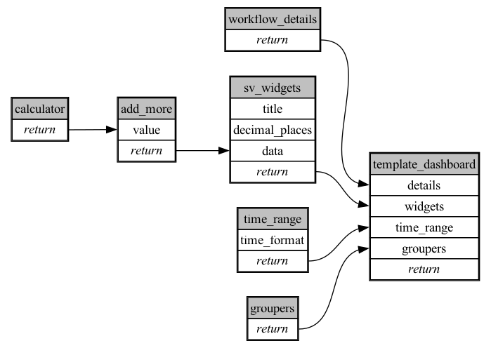

```
# AUTOGENERATED BY ECOSCOPE-WORKFLOWS; see fingerprint in README.md for details

```

```yaml
# fingerprint:
artifacts_sha256_basic: 04df894439d400d930a34db8365b61bf188235df95b5a548955d55bd70de2cfc
artifacts_sha256_strict: 5f398e6802f74bab68082caf195665566efec496ffa044085a1eb645cd261080
installed_requirements:
- channel: https://repo.prefix.dev/ecoscope-workflows/
  name: ecoscope-workflows-core
  version: {version: ==0.2.2}
- channel: file:///tmp/ecoscope-workflows/release/artifacts/
  name: ecoscope-workflows-ext-template
  version: {version: ==0.1.dev9+g913c5cc.d20250526}
params_sha256: 06e2db7cb14c8d24361d298f07737a2ad5a4665984301a91995e370e1c915b98
spec_sha256: 20f6a865928abf5cfc6391ac32c73acd6fcfc81ce0a6d5481289581b2cf3dff6

```

# ecoscope-workflows-template-workflow


